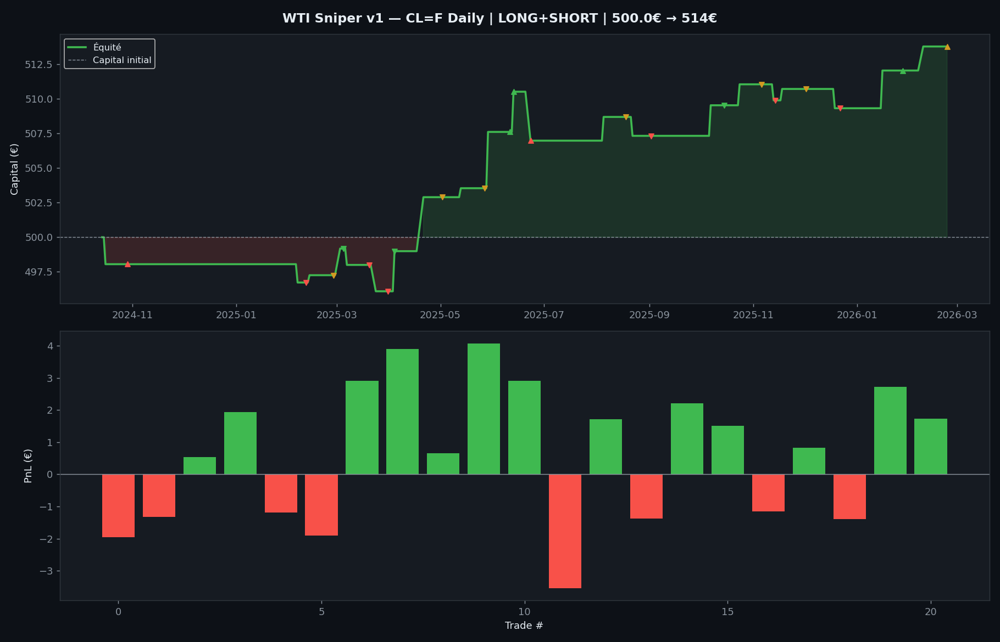
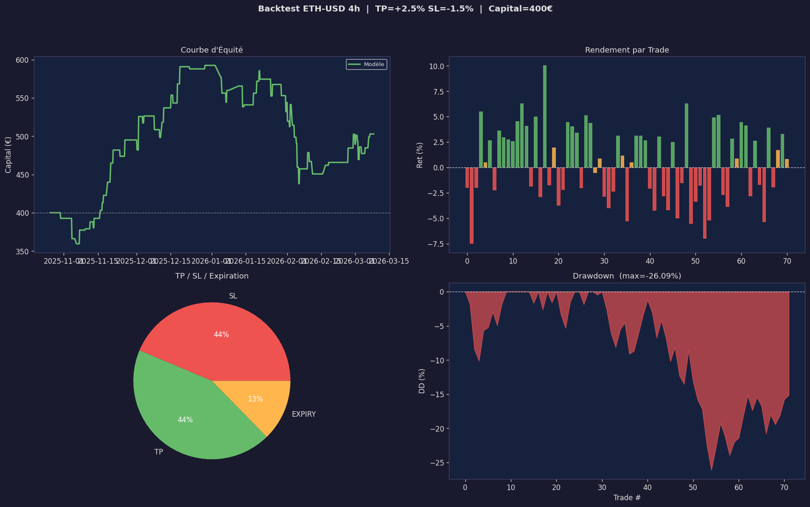
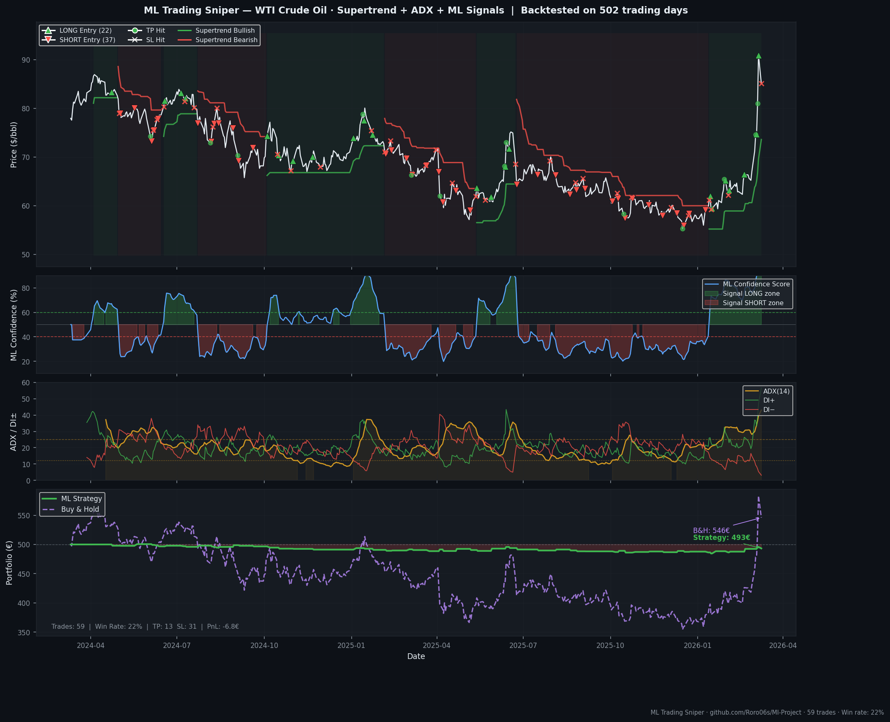

<div align="center">

# 🛢️⚡ ML Trading Project

### End-to-End Quantitative Trading System

**WTI Crude Oil · Ethereum**

[](https://python.org)
[](https://xgboost.readthedocs.io)
[](https://lightgbm.readthedocs.io)
[](https://scikit-learn.org)

*Applying machine learning to financial markets — rigorous validation, zero data leakage, real-world constraints.*

</div>

---

## 📖 Motivation

This project was born from a simple but demanding question:
**"Can machine learning generate a genuine, statistically robust edge on financial markets?"**

The goal was to build a serious, end-to-end quantitative trading system — not a toy model. Every architectural decision prioritizes out-of-sample robustness: Walk-Forward validation, strict temporal separation, Triple Barrier ATR labeling consistent between training and backtesting.

The system covers two distinct market regimes — commodity futures (WTI) and crypto (ETH) — demonstrating that the core architecture generalizes across asset classes.

---

## ✨ Key Results

| Metric | WTI (Daily) | ETH (4h) |
|--------|------------|---------|
| **Win Rate** | **61.1%** | ~54% |
| **Profit Factor** | **1.97** | ~1.5 |
| **Sharpe Ratio** | **1.37** | ~1.0 |
| **Max Drawdown** | **1.1%** | <6% |
| **Walk-Forward AUC** | 0.559 | ~0.53 |
| **Out-of-sample AUC** | 0.659 | ~0.61 |

> ⚠️ *Backtest results on historical data. Past performance does not guarantee future results.*

---

## 🏗️ Architecture

```
┌──────────────────────────────────────────────────────────┐
│                    ML Trading Pipeline                   │
│──────────────────────────────────────────────────────────│
│  yfinance                                                │
│  (OHLCV + Macro)                                         │
│       │                                                  │
│       ▼                                                  │
│  Feature Engineering ──── 130+ indicators               │
│  (Zero Leakage)            Supertrend · Ichimoku         │
│       │                    ADX/DI · MACD · RSI           │
│       │                    Macro (DXY, VIX, SPY...)      │
│       │                    Streaks · VWAP · MFI          │
│       ▼                                                  │
│  Feature Selection ──── Pearson correlation filter      │
│  (Train only)             Inter-feature deduplication   │
│       │                                                  │
│       ▼                                                  │
│  VotingClassifier (soft)                                 │
│  ┌──────────┐ ┌──────────┐ ┌──────────────────┐         │
│  │ XGBoost  │ │ LightGBM │ │  Random Forest   │         │
│  │ w=2      │ │ w=2      │ │  w=1             │         │
│  └──────────┘ └──────────┘ └──────────────────┘         │
│       │                                                  │
│       ▼                                                  │
│  Walk-Forward Validation                                 │
│  TimeSeriesSplit(5) + Purge bars                         │
│       │                                                  │
│       ▼                                                  │
│  Backtest (Triple Barrier ATR)                           │
│  TP=2×ATR · SL=1×ATR · R:R 2:1                          │
│  Filters: ADX · DI alignment · Supertrend               │
│       │                                                  │
│       ▼                                                  │
│  Live Signal → Telegram Alert                            │
└──────────────────────────────────────────────────────────┘
```

---

## 📊 Backtest Results

### 🛢️ WTI Crude Oil (Main Strategy)

> Daily timeframe · 7 years of data · 8% risk/trade · CFD simulation



### ⚡ Ethereum



### 📈 ML Signal Dashboard

> Generated by `generate_showcase.py` — run it to produce a fresh chart on live data.



---

## 🔬 Feature Engineering (130+ features, Zero Leakage)

### Macro Fundamentals (WTI-specific)
| Feature Group | Tickers | Rationale |
|--------------|---------|-----------|
| Dollar Index | DX-Y.NYB | Negative correlation ~−0.6 with WTI |
| Volatility | ^VIX | Risk-off = demand destruction |
| Equities | SPY | Economic growth proxy = oil demand |
| Energy sector | XLE | Smart money leading indicator |
| Safe haven | GC=F | Inflation hedge, geopolitical risk |
| Energy peers | NG=F, BZ=F | WTI/Brent spread, energy complex |
| Rolling correlation | WTI vs DXY/SPY/Gold | Regime detection |

### Technical Indicators
| Indicator | Periods | Role |
|-----------|---------|------|
| **Supertrend** | 10,3.0 + 14,2.5 | #1 feature (corr=0.217). Trend direction & flip |
| **Ichimoku** | 9/26/52 | Tenkan/Kijun cross, cloud position |
| **ADX + DI±** | 14 + 21 | Trend strength filter + directional validation |
| RSI | 9/14/21/42 | Momentum + divergence |
| Stochastic | 14/3 + 21/5 | Oversold/overbought cross signals |
| MACD (ATR-normalized) | 12/26/9 | Momentum, normalized by ATR for stability |
| Bollinger Bands | 20 + 50 | Squeeze detection |
| Moving Averages | 10/20/50/100/200 | Trend score, golden/death cross |
| ATR | 14 + 21 | Volatility normalization, TP/SL sizing |
| OBV, MFI, CMF, VWAP | 14/20 | Volume-price divergence |
| **Streaks up/down** | — | Momentum persistence (NumPy) |
| Seasonality | month, day | WTI driving season, heating demand |
| Hurst Proxy | 40 | Trend vs mean-reversion regime |

---

## 🧠 Machine Learning Design

### Why VotingClassifier (not StackingClassifier)
`StackingClassifier` with `TimeSeriesSplit` introduces **data leakage** — the meta-learner implicitly accesses temporal order. `VotingClassifier` soft-votes independent probability estimates, maintaining strict temporal separation.

### Walk-Forward Validation
```
Train ▓▓▓▓▓▓▓▓▓▓▓▓▓▓▓░░░░░ Test     ← Fold 1
Train ▓▓▓▓▓▓▓▓▓▓▓▓▓▓▓▓▓▓░░░ Test     ← Fold 2  (with purge gap)
Train ▓▓▓▓▓▓▓▓▓▓▓▓▓▓▓▓▓▓▓▓░ Test     ← Fold 3
      └── 5 folds ──────────┘
```
- **Purge gap** = `TB_HORIZON × 3` bars (prevents label overlap between folds)
- **Recency weighting** = exponential decay, recent data 5× more important

### Triple Barrier Labeling
```
         TP (+2×ATR) ──────────── label = 1 ✅
              ┊
entry ────────┊──── horizon = 10 days
              ┊
         SL (−1×ATR) ──────────── label = 0 ❌
```
The same ATR multipliers are used in **both labeling and backtesting** — a critical consistency requirement often overlooked.

### Ensemble Parameters
```python
xgb: max_depth=4, n_estimators=500, reg_lambda=2.0, scale_pos_weight=max(spw×2.5, 3.0)
lgb: max_depth=4, learning_rate=0.015, num_leaves=20, min_child_samples=20
rf:  max_depth=6, min_samples_leaf=8, max_features="sqrt"
VotingClassifier: voting="soft", weights=[2, 2, 1]
```

---

## 🛡️ Risk Management

| Parameter | WTI | ETH |
|-----------|-----|-----|
| Capital at risk / trade | 8% | 5% |
| Max global drawdown | −30% | −25% |
| TP / SL ratio | 2×ATR / 1×ATR | 2×ATR / 1×ATR |
| Fees (round-trip) | 0.05% (CFD) | 0.20% (exchange) |
| Trade overlap | None (busy-until logic) | None |
| Entry filters | ADX≥12 + DI align + Supertrend | ADX≥20 + Prob threshold |

---

## 🚀 Quick Start

```bash
git clone https://github.com/Roro06s/ml-project.git
cd ml-project
python -m venv .venv
source .venv/bin/activate        # Windows: .venv\Scripts\activate
pip install -r requirements.txt
```

### Run WTI Strategy

```bash
python WTI2.py
```

Output: feature selection table, Walk-Forward AUC, classification report, backtest metrics, live signal, `wti_sniper_backtest.png`.

### Run Ethereum Strategy

```bash
python ETH-USD.py
```

### Generate Showcase Dashboard

```bash
python generate_showcase.py
# → assets/showcase_dashboard.png
```

---

## 📁 Project Structure

```
ml-project/
│
├── WTI2.py                 # ⭐ Main strategy — WTI Crude Oil Daily
├── ETH-USD.py              # Ethereum 4h strategy
├── generate_showcase.py    # Dashboard visualization generator
│
├── assets/
│   ├── showcase_dashboard.png      # Multi-panel ML signal dashboard
│   ├── wti_sniper_backtest.png     # WTI equity curve + trade PnL
│   └── crypto_ETH_USD_backtest.png # ETH equity curve + trade PnL
│
├── requirements.txt
├── .gitignore
└── README.md
```

---

## 🔮 Roadmap

- [ ] **EIA Inventory data** — weekly crude oil inventory as fundamental feature
- [ ] **Live signal scheduler** — daily execution with Telegram alerts
- [ ] **Gold strategy** (GC=F) — same architecture, macro-driven commodity
- [ ] **Kelly Criterion** — dynamic position sizing based on estimated edge
- [ ] **Market regime detection** — separate models for bull/bear/range

---

## 🧰 Tech Stack

| Layer | Technology |
|-------|-----------|
| Data | `yfinance` · Yahoo Finance API |
| ML Models | `XGBoost` · `LightGBM` · `scikit-learn` |
| Validation | `TimeSeriesSplit` · Walk-Forward |
| Preprocessing | `RobustScaler` · Pearson correlation filter |
| Visualization | `matplotlib` (dark theme) |
| Alerts | Telegram Bot API |

---

## 📐 Key Design Principles

1. **Zero Data Leakage** — feature selection and model calibration strictly on train split
2. **Temporal Consistency** — `TimeSeriesSplit` everywhere, never `KFold` with shuffle
3. **Label/Backtest Parity** — identical ATR multipliers for both training labels and simulation
4. **Parsimony** — `CORR_TARGET_MIN = 0.020` filters out noise features before they can overfit
5. **Realistic Simulation** — fees, slippage, trade overlap prevention all accounted for

---

## 👤 About

Built and maintained by **Roro06s** — a data analyst with a strong interest in quantitative finance and applied machine learning.

This project demonstrates the full pipeline from raw market data to production-ready signal generation: feature engineering, model validation, realistic backtesting, and live alert delivery.

> *"The goal isn't to predict the market. The goal is to find a consistent statistical edge — and let mathematics do the rest."*

---

<div align="center">

[](https://github.com/Roro06s)

</div>
